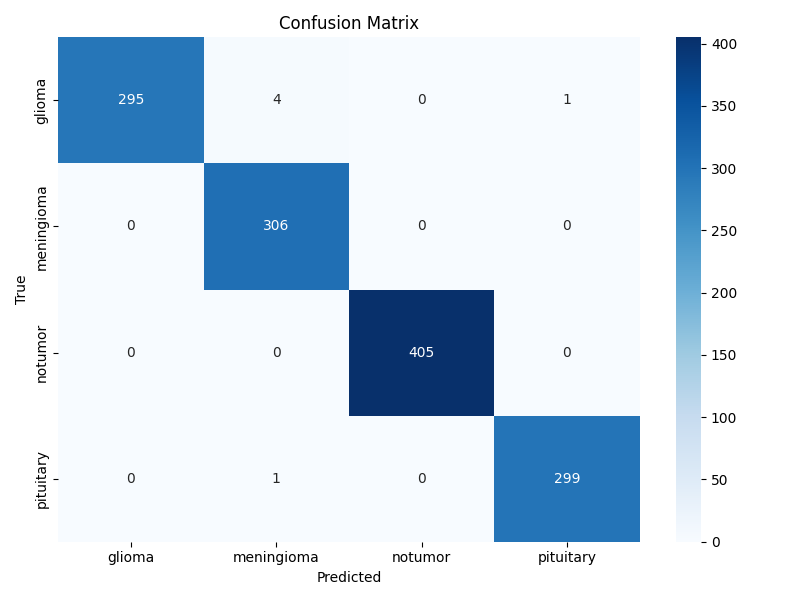
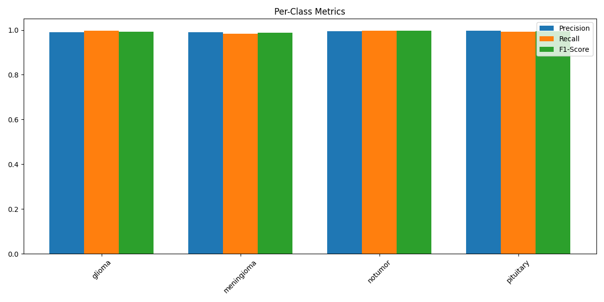

# 🧠 Brain Tumor Detection System using ResNet18 (Flask + PyTorch)

## 📂 Project Structure

```
project/
│
├── app.py                         # Flask app for prediction
├── train_enhanced.py              #Training the model

│
├── templates/
│   └── index.html                 # Frontend interface
│   └── about.html                 # Frontend interface
│   └── scan.html                 # Frontend interface
│
├── brain_tumor_model/
│   ├── resnet18_brain_tumor.pth              # trained model
│   ├── training_metrics.png         # Loss & accuracy plots
│   ├── confusion_matrix.png         # Confusion matrix
│   └── per_class_metrics.png                 # Bar chart of class metrics
```
```
To train the model download Kaggles brain tumor dataset of MRI scans and create folders in the same directory as :
brain_tumor_dataset/

```
---

## 🚀 Features

* Upload MRI scans via a web UI
* Automatically predicts tumor type: `glioma`, `meningioma`, `pituitary`, or `no_tumor`
* Backend powered by fine-tuned **ResNet18**
* Visual metrics: confusion matrix, accuracy curves, and class-wise scores
* Two training options:

  
  * `train_enhanced.py` — clean training on original dataset

---

## ⚙️ How to Run

### 1. Setup Environment

```bash
pip install torch torchvision flask scikit-learn matplotlib seaborn
```

### 2. Model Training (Optional)


```bash

python train_enhanced.py        # With extra data merging
```

### 3. Run the Flask App

Make sure the `resnet18_brain_tumor` file is present in `brain_tumor_model/`.

```bash
python app.py
```


## 🧪 Inference: `/predict` Endpoint

* **Method**: `POST`
* **Payload**: Form with image file (`file`)
* **Response**:

```json
{
  "prediction": "glioma",
  "confidence": "98.32%"
}
```

---

## 🖼️ Frontend Highlights

* Drag-and-drop MRI scan upload
* Real-time preview
* Styled using CSS and Google Fonts
* Displays tumor type and confidence
* Shows tailored info for each tumor class
* Responsive layout for mobile support

> *Note: replace the `REPLACE_WITH_YOUR_BRAIN_IMAGE_URL.jpg` in the CSS background for a cooler UI.*

---

## 📊 Evaluation Results

The model achieved **overall accuracy ranging between 97% to 99%** during validation across multiple runs.

### ✅ Confusion Matrix



### 📈 Training Metrics


### 🔍 Per-Class Metrics



---

## 🧠 Model Architecture

### Base Model
- **ResNet18** pretrained on ImageNet
- Input resolution: 224×224 RGB images

### Fine-tuning Strategy
| Layer Group | Trainable | Details |
|-------------|-----------|---------|
| Layer 1-2   | ❌ Frozen | Maintain pretrained features |
| **Layer 3** | ✅ Unfrozen | Gradual fine-tuning |
| **Layer 4** | ✅ Unfrozen | Gradual fine-tuning |
| **Classifier** | ✅ Replaced | Custom head (see below) |

### Custom Classifier Head
```python
Sequential(
  Linear(in_features=512, out_features=512),
  BatchNorm1d(512),
  ReLU(),
  Dropout(p=0.5),
  Linear(512, out_features=4)
)
Output Layers
4 neurons corresponding to brain tumor classes:


0: glioma
1: meningioma
2: notumor
3: pituitary
Key Features
Progressive Unfreezing: Only deeper layers (3+) fine-tuned

Regularization: 50% Dropout + BatchNorm for robustness

Class Balancing: Weighted loss function handles dataset imbalance

Adaptive Learning: ReduceLROnPlateau scheduler (patience=2, factor=0.5)

Training Configuration
Parameter	Value
Optimizer	AdamW
Weight Decay	1e-4
Batch Size	32
Epochs	30
Loss Function	Weighted CrossEntropyLoss
```


#📬 Credits

Developed with ❤️ using:

* PyTorch
* Flask
* ResNet18
* HTML/CSS + JS
